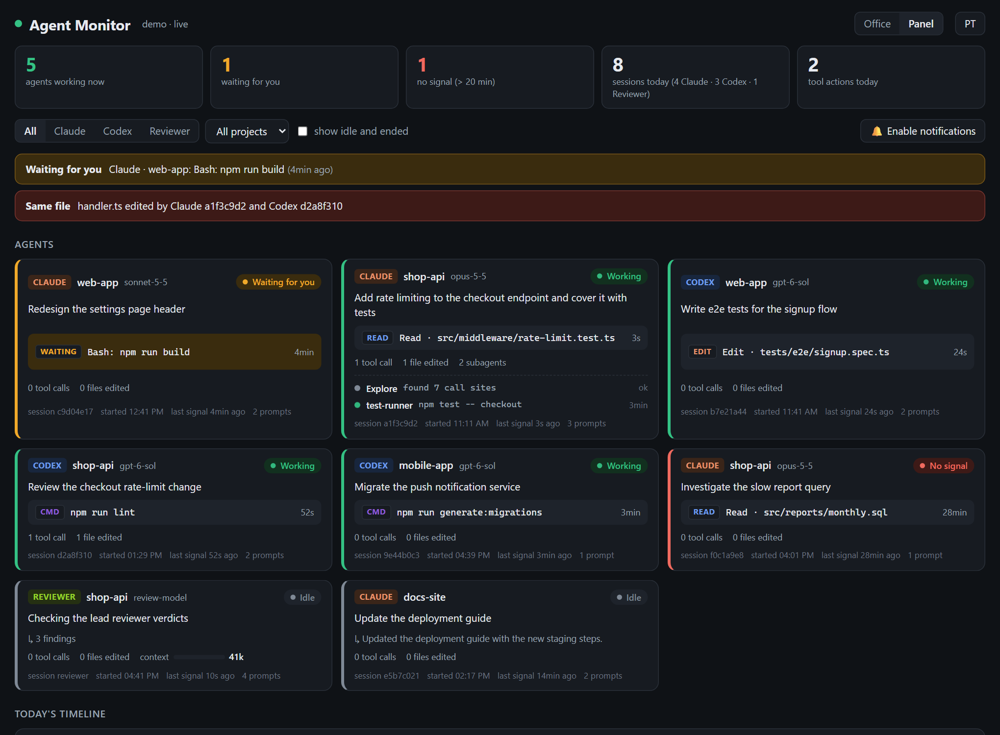
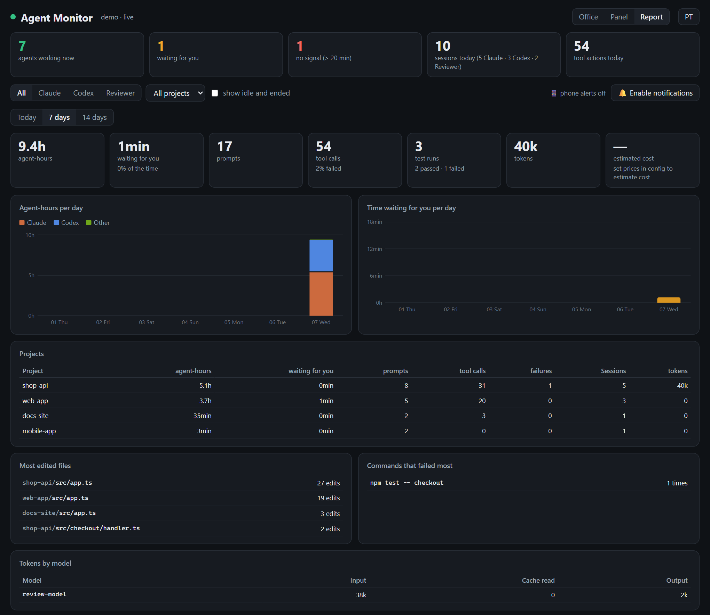

<h1 align="center">Agent Monitor</h1>

<p align="center">
  <b>See what your AI coding agents are doing, live, as a pixel-art office.</b><br>
  Claude Code · Codex · any other agent · runs 100% on your machine
</p>

<p align="center">
  <a href="https://github.com/woinsilva/agent-monitor/actions/workflows/ci.yml"></a>
  <a href="LICENSE"></a>
  
  
</p>

<p align="center">
  <a href="#quick-start">Quick start</a> ·
  <a href="#try-the-demo">Demo</a> ·
  <a href="#how-it-works">How it works</a> ·
  <a href="#phone-notifications">Phone alerts</a> ·
  <a href="#other-agents">Other agents</a> ·
  <a href="README.pt-BR.md">Português</a>
</p>

<picture>
  <source media="(prefers-color-scheme: dark)" srcset="docs/office-dark.png">
  
</picture>

When you run several agents at once (a couple of Claude Code sessions, Codex in
another window, subagents fanning out) it gets hard to tell who is doing what,
who is stuck waiting for you, and whether two of them are editing the same file.
Agent Monitor answers that at a glance.

## Features

- **Office view.** Every session is an employee at a desk: Claude Code on the left,
  Codex on the right, other agents in the meeting room, subagents as interns behind
  the chair of whoever started them. What they do mirrors what the agent does:

  | On screen | Means |
  |---|---|
  | typing, monitor shows a terminal or code | running a command / editing files |
  | reading a sheet | reading or searching code |
  | standing, hand raised, yellow bubble | **waiting for your approval or answer** |
  | arms up, "done!" | just finished a turn |
  | holding a coffee | idle |
  | on the break-room sofa | idle for 15+ minutes |
  | head on the desk, `zZz` | no signal for 20+ minutes |

  Everyone gets a first name, a blinking light marks the desk of whoever is waiting
  for you, and agents walk in through the door when they start and leave when the
  session ends.
- **Same-file alert.** A red dashed line links two agents that edited the same file
  in the last hour, even across Claude Code and Codex.
- **Panel view.** One card per session with the prompt, the current action and for
  how long, how long it has been on this prompt, the **last test run (passed / failed)**,
  the **git branch and uncommitted files**, tool calls, failures, files edited,
  context-window use and subagents.
- **Report.** Agent-hours per day for Claude, Codex and others, **how much time your
  agents spent waiting for you**, prompts, tool calls and failure rate, test runs,
  tokens by model and estimated cost, per-project totals, most edited files and the
  commands that fail most. Today, 7 or 14 days.
- **Running-long alert** when a prompt goes past 30 minutes (configurable).
- **History.** Click anyone to see their full timeline: prompts, commands, edits,
  permission requests, subagents, replies.
- **Today's timeline** with how many agents ran at the same time.
- **Phone notifications** through [ntfy](https://ntfy.sh) or Telegram when an agent
  waits for you, runs long, goes silent or finishes, so you can step away from the desk.
- **Desktop notifications** with a chime when an agent starts waiting for you
  (optionally also when one finishes), and a tab title like `(2) Waiting for you`.
- **Plan limits:** Claude's 5-hour and weekly usage (through Claude Code's status line,
  see below) and Codex's weekly limit, with a phone alert when one passes 80%.
- **Token use** read from the agents' own session files.
- **Zero tokens, zero dependencies.** The hooks print nothing, so nothing enters
  the model's context. Plain Node.js, no `npm install`.
- English and Portuguese, following your browser.

<details>
<summary><b>Panel view</b></summary>
<br>

</details>

<details>
<summary><b>Report view</b></summary>
<br>

</details>

## Try the demo

No agents or setup needed: this fills a throwaway folder with fictional agents and
keeps them busy.

```sh
git clone https://github.com/woinsilva/agent-monitor.git
cd agent-monitor
node demo.js
```

Open http://localhost:4401.

## Quick start

Requires **Node.js 18+**. Docker is optional.

```sh
git clone https://github.com/woinsilva/agent-monitor.git
cd agent-monitor

# 1. install the hooks: for one project...
node install.js /path/to/your/project
#    ...or for every project of your user
node install.js --global

# 2. start the dashboard
node server.js
```

Open http://localhost:4400 and send a prompt to Claude Code or Codex. The first time,
Codex asks you to trust the new hooks: accept them. Sessions that were already open
may need a restart to pick the hooks up.

### Keep it running with Docker

```sh
node setup.js                    # detects your time zone and the agents' folders, writes .env
docker compose up -d --build
```

The container restarts whenever Docker starts, so if Docker starts with your
computer, so does the dashboard. `start.cmd` / `start.sh` bring it up and open the
browser; `stop.cmd` / `stop.sh` stop it until you start it again. After changing
`server.js` or `public/`, run `docker compose up -d --build` again.

## How it works

```
Claude Code / Codex --hooks--> hook.js   --\
any other agent -------------> report.js ---> data/events-YYYY-MM-DD.jsonl --> server.js --> browser
                                              token use: read from the agents' own session files
```

- **`hook.js`** runs on every hook event (prompt, tool use, permission request, end of
  turn, subagent start/stop, session end). It appends one short JSON line and prints
  nothing. About 60 ms per event, and it always exits 0, so a monitoring problem can
  never block an agent.
- **`server.js`** follows those files, rebuilds every session's state and streams it to
  the page (Server-Sent Events). Context use comes from Claude Code's transcripts
  (`~/.claude/projects`) and Codex's rollouts (`~/.codex/sessions`).
- **`public/`** is plain HTML and JavaScript. The office is drawn in code on a canvas,
  with no image files.

### Privacy

Everything stays on your machine. The server only listens on `127.0.0.1`, and only
metadata is recorded: tool names, the command or file path, and the first 300
characters of each prompt. File contents and command output are never stored. Event
files older than 14 days are deleted automatically. All of it lives in `data/`.

## Phone notifications

Get a push notification on your phone when an agent needs you, so you can leave the
desk while agents work. Settings live in `config/config.json` (created by
`node setup.js`, or copy `config/config.example.json`). Changes apply without a restart.

**ntfy** (free, no account):

1. Install the ntfy app ([Android](https://play.google.com/store/apps/details?id=io.heckel.ntfy) / [iOS](https://apps.apple.com/app/ntfy/id1625396347)).
2. Subscribe to a topic with a long, random name, e.g. `agent-monitor-k3v9x2q7m1`.
3. Put the same name in `config/config.json`:
   ```json
   "notify": { "ntfy": { "topic": "agent-monitor-k3v9x2q7m1" } }
   ```
4. `node lib/notify.js --test` sends a test message.

On the public ntfy.sh server anyone who knows the topic name can read it, so keep the
name hard to guess; you can also point `notify.ntfy.server` at your own ntfy server
and set `token`.

**Telegram:** create a bot with [@BotFather](https://t.me/BotFather), send it a message,
take your chat id from `https://api.telegram.org/bot<token>/getUpdates`, and set
`notify.telegram.botToken` and `chatId`.

| Setting | Default | |
|---|---|---|
| `notify.events.waiting` | `true` | an agent is waiting for your approval or answer |
| `notify.events.longRunning` | `true` | a prompt passed `longRunningMinutes` (30) |
| `notify.events.stale` | `false` | a working agent went silent for 20+ minutes |
| `notify.events.finished` | `false` | an agent finished its turn |
| `notify.events.limit` | `true` | a Claude or Codex plan limit passed `notify.limitPercent` (80) |
| `notify.waitingDelaySeconds` | `30` | only alert if it is still waiting after this, so quick approvals at the desk don't buzz your phone |
| `notify.details` | `false` | add the command or prompt to the message (off by default: messages leave your machine) |
| `language` | `en` | `en` or `pt` |

### Claude plan limits

Claude Code shares the plan usage (5-hour and weekly windows, Pro and Max plans) only
with its [status line](https://code.claude.com/docs/en/statusline). To get it on the
dashboard, install Agent Monitor's status line:

```sh
node install.js --statusline          # writes statusLine to ~/.claude/settings.json
node install.js --statusline --remove
```

It also shows `5h 23% · week 41% · ctx 38%` in Claude Code's footer. It runs locally and
costs no tokens. It will not replace a status line you already have; in that case,
pipe your script's input to `statusline.js` too. Numbers show up after the first reply
of a new session. The phone alert fires once per window when usage passes
`notify.limitPercent` (80).

### Cost estimate

Token use is always shown. To also estimate cost, add the prices you pay (USD per
million tokens) under `prices`, keyed by model id prefix; the longest matching prefix
wins:

```json
"prices": {
  "claude-opus":   { "input": 0, "output": 0, "cacheRead": 0, "cacheWrite": 0 },
  "gpt-6":         { "input": 0, "output": 0, "cacheRead": 0 }
}
```

Fill in the current numbers from each provider's pricing page. On a subscription plan
this is an API-equivalent estimate, not what you are billed.

## Installing the hooks

```sh
node install.js <project-dir>            # this project only
node install.js --global                 # every project of this user
node install.js <project-dir> --remove   # remove only Agent Monitor's hooks
```

| | Claude Code | Codex |
|---|---|---|
| project | `<project>/.claude/settings.local.json` | `<project>/.codex/hooks.json` |
| global | `~/.claude/settings.json` | `~/.codex/hooks.json` (experimental) |

Hooks you already have are kept, and each file is backed up as
`*.bak-agent-monitor` before its first change. Use either per-project or global for
a given project, not both, or every event arrives twice.

## Other agents

Anything without hooks (a script calling another model's API, a review bot, a CI
job, your own agent) can report itself with `report.js` and shows up in the office's
meeting room:

```sh
node report.js start --client reviewer --prompt "Independent review of the diff" --model some-model
node report.js tool  --client reviewer --kind read --summary "reading the patch"
node report.js stop  --client reviewer --reply "3 findings" --input-tokens 41000 --output-tokens 2300
node report.js end   --client reviewer
```

Calls from the same script run share a session automatically (or pass `--session`).
`wait` marks the agent as waiting for you and `stop --failed` records a failure. The
header of `report.js` lists every option.

<details>
<summary>Writing the events yourself, from any language</summary>
<br>

Append one JSON object per line to `data/events-YYYY-MM-DD.jsonl` (local date):

```json
{"ts": 1767225600000, "client": "reviewer", "event": "UserPromptSubmit", "session": "run-42", "cwd": "/path/to/project", "prompt": "Reviewing the diff"}
{"ts": 1767225660000, "client": "reviewer", "event": "Stop", "session": "run-42", "cwd": "/path/to/project", "reply": "3 findings", "usage": {"input_tokens": 41000, "output_tokens": 2300}}
```

| `event` | Meaning | Useful fields |
|---|---|---|
| `UserPromptSubmit` | started working | `prompt`, `model` |
| `PostToolUse` | did something | `tool`, `kind` (`command`, `edit`, `read`, `search`, `web`), `summary`, `files` |
| `PermissionRequest` | waiting for you | `summary` |
| `Stop` | finished | `reply`, `failed`, `usage` |
| `SessionEnd` | left | |

</details>

## Statuses

| Status | Meaning |
|---|---|
| Working | between the prompt and the end of the turn |
| Waiting for you | asked for permission or for your answer |
| No signal | marked as working but silent for 20+ minutes (killed or hung) |
| Idle | turn finished; listed for 3 hours, then only with "show idle and ended" |
| Ended / Done | session closed / subagent finished |

## Troubleshooting

- **Nothing shows up.** Check that `data/` gets a new line when you send a prompt.
  If not, the hooks are not installed where the agent runs: re-run `install.js` for
  that folder and restart the agent session. In Codex, make sure you trusted the hooks.
- **Some fields look empty.** Agents change their hook payloads over time.
  `data/payload-shapes.json` keeps one real example per agent and event, which shows
  what to adapt in `hook.js`.
- **Docker shows no token use.** Re-run `node setup.js` and `docker compose up -d --build`
  so the container mounts the right session folders.

## Project layout

| File | Role |
|---|---|
| `hook.js` | hook handler called by Claude Code and Codex |
| `statusline.js` | Claude Code status line that records the plan limits |
| `install.js` | adds/removes the hooks |
| `report.js` | reporter for any other agent |
| `server.js` | state, token reading, HTTP + live stream |
| `public/` | the page: `index.html`, `office.js` (pixel-art office), `i18n.js` (strings) |
| `lib/` | `config.js`, `notify.js` (phone alerts), `report.js` (the report) |
| `config/` | `config.example.json`; your `config.json` stays out of git |
| `demo.js` | demo mode with fictional agents |
| `test/` | `node --test` (no dependencies), run in CI on Linux, macOS and Windows |
| `setup.js`, `docker-compose.yml`, `Dockerfile` | Docker setup |

## License

[MIT](LICENSE)
