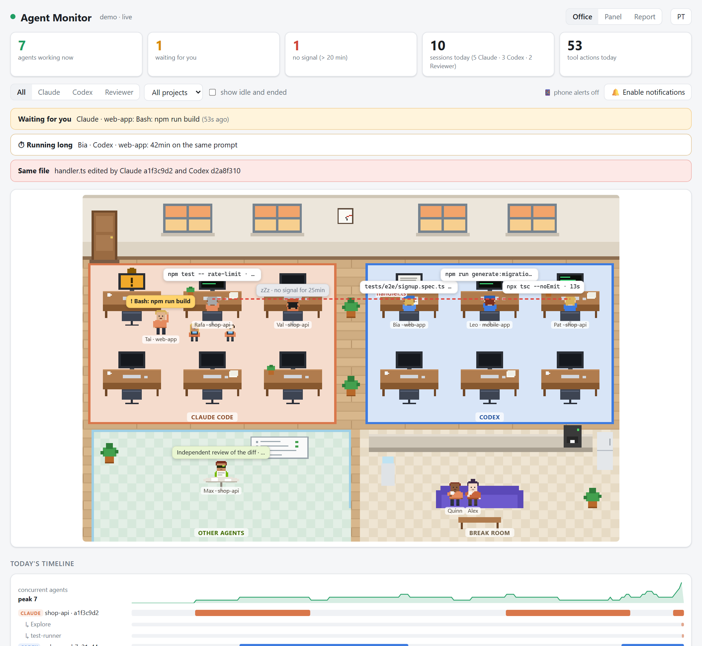

<h1 align="center">Agent Monitor</h1>

<p align="center">
  <b>Veja ao vivo o que seus agentes de IA estão fazendo, num escritório em pixel art.</b><br>
  Claude Code · Codex · qualquer outro agente · roda 100% no seu computador
</p>

<p align="center">
  <a href="#começando">Começando</a> ·
  <a href="#demonstração">Demonstração</a> ·
  <a href="#outros-agentes">Outros agentes</a> ·
  <a href="README.md">English</a>
</p>

<picture>
  <source media="(prefers-color-scheme: dark)" srcset="docs/office-dark.png">
  
</picture>

Quando você roda vários agentes ao mesmo tempo (algumas sessões do Claude Code, o
Codex em outra janela, subagentes trabalhando em paralelo), fica difícil saber quem
está fazendo o quê, quem está parado esperando você e se dois deles estão mexendo no
mesmo arquivo. O Agent Monitor mostra isso de relance.

## O que ele faz

- **Escritório.** Cada sessão é um funcionário numa mesa: Claude Code à esquerda,
  Codex à direita, outros agentes na sala de reunião e subagentes como estagiários
  atrás da cadeira de quem os chamou.

  | Na tela | Significa |
  |---|---|
  | digitando, monitor com terminal ou código | rodando comando / editando arquivos |
  | lendo um papel | lendo ou buscando código |
  | em pé, mão levantada, balão amarelo | **esperando sua aprovação ou resposta** |
  | braços para cima, "pronto!" | acabou de terminar um turno |
  | com café na mão | ocioso |
  | no sofá da copa | ocioso há mais de 15 minutos |
  | cabeça na mesa, `zZz` | sem sinal há mais de 20 minutos |

  Cada um tem um nome, uma luz pisca na mesa de quem está esperando você, e os
  agentes entram pela porta quando começam e saem quando a sessão termina.
- **Alerta de mesmo arquivo.** Uma linha vermelha liga dois agentes que editaram o
  mesmo arquivo na última hora, inclusive entre Claude Code e Codex.
- **Painel.** Um card por sessão com o pedido, a ação atual e há quanto tempo,
  ferramentas usadas, falhas, arquivos editados, uso do contexto e subagentes.
- **Selos nos cards:** há quanto tempo está no pedido atual, **resultado do último
  teste** (passou/falhou) e **branch do git com arquivos sem commit**.
- **Relatório** de hoje, 7 ou 14 dias: horas de agente por dia, **quanto tempo os
  agentes ficaram esperando você**, pedidos, falhas, testes, tokens por modelo, custo
  estimado, totais por projeto, arquivos mais editados e comandos que mais falham.
- **Alerta de demora** quando um pedido passa de 30 minutos (configurável).
- **Aviso no celular** pelo [ntfy](https://ntfy.sh) ou Telegram quando um agente espera
  você, demora, fica sem sinal ou termina.
- **Histórico** completo ao clicar em qualquer agente.
- **Linha do tempo do dia**, com quantos agentes rodaram ao mesmo tempo.
- **Notificações** com som quando um agente fica esperando você (e, se quiser,
  quando termina), e o título da aba vira `(2) Esperando você`.
- **Uso de tokens** lido dos próprios arquivos de sessão, mais o limite semanal do Codex.
- **Zero tokens, zero dependências.** Os hooks não imprimem nada, então nada entra
  no contexto da IA. Só Node.js, sem `npm install`.
- Em português e inglês, conforme o navegador.

## Demonstração

Sem agentes e sem configurar nada: enche uma pasta temporária com agentes fictícios.

```sh
git clone https://github.com/woinsilva/agent-monitor.git
cd agent-monitor
node demo.js
```

Abra http://localhost:4401.

## Começando

Precisa de **Node.js 18+**. Docker é opcional.

```sh
git clone https://github.com/woinsilva/agent-monitor.git
cd agent-monitor

# 1. instale os hooks: para um projeto...
node install.js /caminho/do/projeto
#    ...ou para todos os projetos do seu usuário
node install.js --global

# 2. suba o painel
node server.js
```

Abra http://localhost:4400 e mande um pedido ao Claude Code ou ao Codex. Na primeira
vez o Codex pede para confiar nos hooks novos: aceite. Sessões que já estavam abertas
podem precisar ser reabertas.

### Deixar sempre no ar com Docker

```sh
node setup.js                    # detecta o fuso e as pastas dos agentes, gera o .env
docker compose up -d --build
```

O container volta sempre que o Docker inicia; se o Docker abre com o computador, o
painel também. `start.cmd` / `start.sh` sobem e abrem o navegador; `stop.cmd` /
`stop.sh` param até você iniciar de novo.

### Privacidade

Tudo fica no seu computador. O servidor só escuta em `127.0.0.1` e grava apenas
metadados: nome da ferramenta, o comando ou caminho do arquivo e os primeiros 300
caracteres de cada pedido. Conteúdo de arquivos e saída de comandos nunca são
gravados. Eventos com mais de 14 dias são apagados sozinhos. Tudo fica em `data/`.

## Aviso no celular

As configurações ficam em `config/config.json` (criado pelo `node setup.js`).

**ntfy** (grátis, sem conta): instale o app ntfy no celular, assine um canal com um
nome longo e aleatório (ex.: `agent-monitor-k3v9x2q7m1`) e coloque o mesmo nome em
`"notify": { "ntfy": { "topic": "..." } }`. Teste com `node lib/notify.js --test`.
No servidor público ntfy.sh, quem souber o nome do canal consegue ler: mantenha o nome
difícil de adivinhar. Por padrão a mensagem só diz qual agente e qual projeto; o
comando só vai junto se você ligar `notify.details`.

**Telegram:** crie um bot com o @BotFather e preencha `notify.telegram.botToken` e
`chatId`. As opções de cada aviso e os preços para o custo estimado estão no
[README em inglês](README.md#phone-notifications).

## Limites do plano do Claude

O Claude Code só informa o uso do plano (janelas de 5 horas e semanal, planos Pro e
Max) para a barra de status. Para levar isso ao painel:

```sh
node install.js --statusline
```

Ela também mostra `5h 23% · semana 41% · contexto 38%` no rodapé do Claude Code, roda
localmente e não gasta tokens. O aviso no celular chega uma vez por janela quando o uso
passa de 80%.

## Outros agentes

Qualquer coisa sem hooks (um script que chama a API de outro modelo, um bot de
review, um job de CI, seu próprio agente) pode se reportar com o `report.js` e
aparece na sala de reunião do escritório:

```sh
node report.js start --client revisor --prompt "Revisão independente do diff"
node report.js stop  --client revisor --reply "3 achados" --input-tokens 41000 --output-tokens 2300
node report.js end   --client revisor
```

Chamadas do mesmo script caem na mesma sessão automaticamente. `wait` marca como
esperando você e `stop --failed` registra uma falha.

O funcionamento interno, a instalação dos hooks, o formato dos eventos e a solução de
problemas estão detalhados no [README em inglês](README.md).

## Licença

[MIT](LICENSE)
